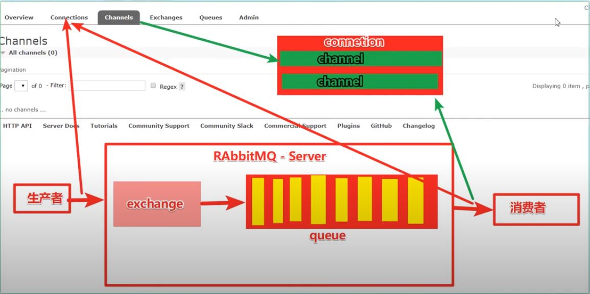
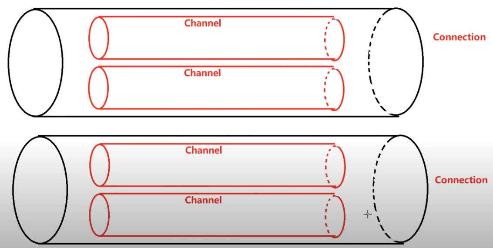

# RabbitMQ
## 1.1 消息中間件
### 什麼是消息中間件 
#### 資訊序列(Message Queue)
* 應用程式與應用程式的通訊方法

#### 為甚麼用
* 可將依些無須及時返回且耗時的操作提取出來,進行異步處理,可以節省server請求響應的時間,進而提高系統的吞吐量

#### 使用場景：
1. 任務異步處理:
        將不需要同步處理且耗時長的操作，由資訊序列通知接收方進行異步處理。提高應用程式響應時間
2. 應用程式解耦
        MQ相當於一個中介，透過MQ進行交互
3. 削峰填谷
        將突發的大量請求暫存，再慢慢寫入

## 1.2 協議
### 主流方式

* AMQP(高級消息隊列協議)：
    >* 是一種binary wire-level protocol(鏈接協議),不從API限定(使用任何語言皆可)，直接定義網路交換的格式
    >* 透過規定協議來統一資料交換格式
    >* 跨語言
    >* AMQP資訊模式更豐富

* JMS(JAVA消息服務)：
    >* 是JAVA對中間件的API,用於兩個應用程式間、或分散式系統中發送訊息，進行異步通訊
    >* 定義統一的接口，對訊息操作進行統一
    >* 必須使用Java
    >* 規定兩種模式

## 1.3 RabbitMQ
### 基於AMQP
### 提供六種模式：
* 簡單模式
* work模式
* Publish/Subscibe發布與訂閱模式
* Routing路由模式
* Topics主題模式
* RPC遠程調用模式

# 2.安裝
    docker run -d --hostname my-rabbit --name some-rabbit -p 15672:15672 rabbitmq:3-management

## 預設帳號
    guest/ guest

## 角色
* 超級管理員:可登管理控制台,查看所有訊息,可對用戶、策略進行操作
* 監控者(monitoring):可登管理控制台,可看rabbitmq節點相關訊息(進程數,內存使用狀況,硬碟使用狀況)
* 策略制定者:可登管理控制台,對policy進行管理
* 普通管理者:僅可登管理控制台,無法看到節點資訊
* 其他

## Virtual Hosts設定
* rabbitmq可以透過Virtual Host,來指定操作權限
* 每個VH相當於一個相對獨立的RabbitMQ伺服器，彼此互相隔離

# 3.RabbitMQ 入門
## 3.1 基本架構


## 3.2 建立連結
### 寫一個工具class ConnectionUtil
```java
package com.springboot30day.other;

import java.io.IOException;
import java.util.concurrent.TimeoutException;

import com.rabbitmq.client.Connection;
import com.rabbitmq.client.ConnectionFactory;

public class ConnectionUtil {
    static final String QUEUE_NAME = "simple_queue";
    static final String HOST = "127.0.0.1";
    static final int PORT = 5672;

    public static Connection getConnection() throws IOException, TimeoutException {
        //工廠
        ConnectionFactory factory = new ConnectionFactory();
        // 位址
        factory.setHost(HOST);
        factory.setPort(PORT);

        // 虛擬主機
        factory.setVirtualHost("/itjeff");
        // 用戶
        factory.setUsername("jeff");
        factory.setPassword("123456");

        //產生連結
        Connection conn = factory.newConnection();

        return conn;
    }

    private ConnectionUtil() {
        throw new IllegalStateException("Utility class");
    }

}

```

### 3.3 Producer
```java
import com.rabbitmq.client.Channel;
import com.rabbitmq.client.Connection;

import lombok.extern.slf4j.Slf4j;

@Slf4j
// 生產者
public class Producer {

    public static void main(String[] args) {

        try (
                // 建立連接
                Connection conn = ConnectionUtil.getConnection();
                // 建立頻道
                Channel channel = conn.createChannel();) {

            // channel declare queue
            /*
             * @param queue 序列名
             * 
             * @param durable 是否要持久化(伺服器重啟是否在)
             * 
             * @param exclusive 是否獨佔連接(通常false希望一個conn有多個channel)
             * 
             * @param autoDelete 不使用的時候自動刪除
             * 
             * @param arguments 其他參數
             */
            channel.queueDeclare(ConnectionUtil.QUEUE_NAME, true, false, false, null);

            // 發送訊息
            String msg = "安安你好";
            channel.basicPublish("", ConnectionUtil.QUEUE_NAME, null, msg.getBytes());
            log.info("已發送訊息:" + msg);

        } catch (Exception e) {
            e.printStackTrace();
        }

    }

}
```

### 3.4 Consumer
```java
import java.io.IOException;
import java.util.concurrent.TimeoutException;

import com.rabbitmq.client.Channel;
import com.rabbitmq.client.Connection;
import com.rabbitmq.client.DefaultConsumer;
import com.rabbitmq.client.Envelope;
import com.rabbitmq.client.AMQP.BasicProperties;

import lombok.extern.slf4j.Slf4j;

//消費者
@Slf4j
public class Consumer {
    public static void main(String[] args) throws IOException, TimeoutException {
        // 建立連接
        Connection conn = ConnectionUtil.getConnection();
        // 建立頻道
        Channel channel = conn.createChannel();

        // 宣告序列
        channel.queueDeclare(ConnectionUtil.QUEUE_NAME, true, false, false, null);

        // new 消費者:監聽訊息
        DefaultConsumer consumer = new DefaultConsumer(channel) {

            // handleDelivery 處理訊息
            // consumerTag:消費者標籤
            // envelope:訊息包內容,可以取得訊息id,routingkey,exchange,訊息與重轉標記
            // properties:訊息屬性
            // body:訊息
            @Override
            public void handleDelivery(String consumerTag, Envelope envelope, BasicProperties properties, byte[] body)
                    throws IOException {
                // routingkey
                log.info(envelope.getRoutingKey());
                // exchange
                log.info(envelope.getExchange());
                // 訊息id
                log.info(String.valueOf(envelope.getDeliveryTag()));
                // 訊息
                log.info(new String(body, "UTF-8"));
            }
        };

        // 監聽訊息
        // 序列名稱
        // 自動確認:true為自動向mq回覆,mq收到回覆會刪除訊息
        channel.basicConsume(ConnectionUtil.QUEUE_NAME, true, consumer);

    }
}
```

# 4 AMQP
## 4.1 相關概念
### 特點
* 多通道
* 協商式
* 異步
* 安全
* 擴平台
* 中立
* 高效

| 概念 | 說明 | 
| :-----| :---- |
| Connection<br>連結 | 一個網路的連結,如 TCP/IP Socket (網址:port) |
| Session | 端點間的命名對話 session context 保證傳遞一次 |
| Channel | 多路複用Connection中的一條獨立雙向資訊通道.為session提供傳輸管道<br> |
| Client | AMQP Connection 或 Session 的發起者,為非對稱,生產和消費訊息,伺服器儲存和routing這些訊息,Producer、Consumer 統稱 Client |
|Broker <br> 服務節點|可以看做RabbitMQ的伺服器|
|端點|AMQP 連接包含兩個端點(Client,Server)|
|Producer|向exchange發送訊息的應用|
|Consumer|向Queue請求訊息的應用|
<br>

## 4.2 RabbitMQ 運轉過程
### 入門案例中

* Producer發送訊息
    1. Producer 建立 Connection,開啟一個Channel,連結到RabbitMQ Broker
    2. 宣告Queue並設定屬性:排他、持久化、自動刪除
    3. 將Routing Key (空字串)與Queue綁定
    4. 發送訊息給RabbitMQ Broker
    5. 關閉Channel
    6. 關閉Connection
* Consumer接收訊息
    1. Consumer 建立 Connection,開啟一個Channel,連結到RabbitMQ Broker
    2. 向Broker 請求對應序列的訊息,設定對應的方法
    3. 等待Broker回應關閉響應序列的訊息,Consumer接收訊息
    4. 確認(ack 自動確認)接收到的訊息
    5. RabbitMQ從序列中刪除已經確認的訊息
    6. 關閉channel
    7. 關閉Connection

# 5. RabbitMQ工作模式
## 5.1 Work queues 工作序列模式
### 5.1.1 模式說明
#### 生產者將訊息放入序列中,會有多個Consumers
#### **應用場景**：對任務過重或任務較多的情況使用Work queues可以提高任務處理速度

