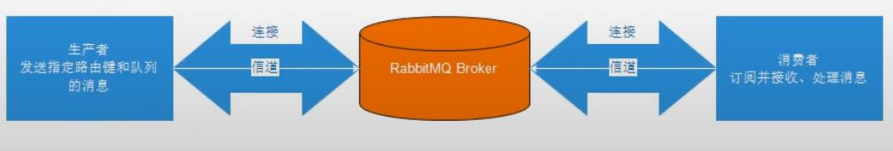

# RabbitMQ
## 1.1 消息中間件
### 什麼是消息中間件 
#### 資訊序列(Message Queue)
* 應用程式與應用程式的通訊方法

#### 為甚麼用
* 可將依些無須及時返回且耗時的操作提取出來,進行異步處理,可以節省server請求響應的時間,進而提高系統的吞吐量

#### 使用場景：
1. 任務異步處理:
        將不需要同步處理且耗時長的操作，由資訊序列通知接收方進行異步處理。提高應用程式響應時間
2. 應用程式解耦
        MQ相當於一個中介，透過MQ進行交互
3. 削峰填谷
        將突發的大量請求暫存，再慢慢寫入

## 1.2 協議
### 主流方式

* AMQP(高級消息隊列協議)：
    >* 是一種binary wire-level protocol(鏈接協議),不從API限定(使用任何語言皆可)，直接定義網路交換的格式
    >* 透過規定協議來統一資料交換格式
    >* 跨語言
    >* AMQP資訊模式更豐富

* JMS(JAVA消息服務)：
    >* 是JAVA對中間件的API,用於兩個應用程式間、或分散式系統中發送訊息，進行異步通訊
    >* 定義統一的接口，對訊息操作進行統一
    >* 必須使用Java
    >* 規定兩種模式

## 1.3 RabbitMQ
### 基於AMQP
### 提供六種模式：
* 簡單模式
* work模式
* Publish/Subscibe發布與訂閱模式
* Routing路由模式
* Topics主題模式
* RPC遠程調用模式

# 2.安裝
    docker run -d --hostname my-rabbit --name some-rabbit -p 15672:15672 rabbitmq:3-management

## 預設帳號
    guest/ guest

## 角色
* 超級管理員:可登管理控制台,查看所有訊息,可對用戶、策略進行操作
* 監控者(monitoring):可登管理控制台,可看rabbitmq節點相關訊息(進程數,內存使用狀況,硬碟使用狀況)
* 策略制定者:可登管理控制台,對policy進行管理
* 普通管理者:僅可登管理控制台,無法看到節點資訊
* 其他

## Virtual Hosts設定
* rabbitmq可以透過Virtual Host,來指定操作權限
* 每個VH相當於一個相對獨立的RabbitMQ伺服器，彼此互相隔離

# 3.RabbitMQ 入門
## 3.1 基本架構


## 3.2 建立連結
### 寫一個工具class ConnectionUtil
```java
package com.springboot30day.other;

import java.io.IOException;
import java.util.concurrent.TimeoutException;

import com.rabbitmq.client.Connection;
import com.rabbitmq.client.ConnectionFactory;

public class ConnectionUtil {
    static final String QUEUE_NAME = "simple_queue";
    static final String HOST = "127.0.0.1";
    static final int PORT = 5672;

    public static Connection getConnection() throws IOException, TimeoutException {
        //工廠
        ConnectionFactory factory = new ConnectionFactory();
        // 位址
        factory.setHost(HOST);
        factory.setPort(PORT);

        // 虛擬主機
        factory.setVirtualHost("/itjeff");
        // 用戶
        factory.setUsername("jeff");
        factory.setPassword("123456");

        //產生連結
        Connection conn = factory.newConnection();

        return conn;
    }

    private ConnectionUtil() {
        throw new IllegalStateException("Utility class");
    }

}

```

### 3.3 Producer
```java
import com.rabbitmq.client.Channel;
import com.rabbitmq.client.Connection;

import lombok.extern.slf4j.Slf4j;

@Slf4j
// 生產者
public class Producer {

    public static void main(String[] args) {

        try (
                // 建立連接
                Connection conn = ConnectionUtil.getConnection();
                // 建立頻道
                Channel channel = conn.createChannel();) {

            // channel declare queue
            /*
             * @param queue 序列名
             * 
             * @param durable 是否要持久化(伺服器重啟是否在)
             * 
             * @param exclusive 是否獨佔連接(通常false希望一個conn有多個channel)
             * 
             * @param autoDelete 不使用的時候自動刪除
             * 
             * @param arguments 其他參數
             */
            channel.queueDeclare(ConnectionUtil.QUEUE_NAME, true, false, false, null);

            // 發送訊息
            String msg = "安安你好";
            channel.basicPublish("", ConnectionUtil.QUEUE_NAME, null, msg.getBytes());
            log.info("已發送訊息:" + msg);

        } catch (Exception e) {
            e.printStackTrace();
        }

    }

}
```

### 3.4 Consumer
```java
import java.io.IOException;
import java.util.concurrent.TimeoutException;

import com.rabbitmq.client.Channel;
import com.rabbitmq.client.Connection;
import com.rabbitmq.client.DefaultConsumer;
import com.rabbitmq.client.Envelope;
import com.rabbitmq.client.AMQP.BasicProperties;

import lombok.extern.slf4j.Slf4j;

//消費者
@Slf4j
public class Consumer {
    public static void main(String[] args) throws IOException, TimeoutException {
        // 建立連接
        Connection conn = ConnectionUtil.getConnection();
        // 建立頻道
        Channel channel = conn.createChannel();

        // 宣告序列
        channel.queueDeclare(ConnectionUtil.QUEUE_NAME, true, false, false, null);

        // new 消費者:監聽訊息
        DefaultConsumer consumer = new DefaultConsumer(channel) {

            // handleDelivery 處理訊息
            // consumerTag:消費者標籤
            // envelope:訊息包內容,可以取得訊息id,routingkey,exchange,訊息與重轉標記
            // properties:訊息屬性
            // body:訊息
            @Override
            public void handleDelivery(String consumerTag, Envelope envelope, BasicProperties properties, byte[] body)
                    throws IOException {
                // routingkey
                log.info(envelope.getRoutingKey());
                // exchange
                log.info(envelope.getExchange());
                // 訊息id
                log.info(String.valueOf(envelope.getDeliveryTag()));
                // 訊息
                log.info(new String(body, "UTF-8"));
            }
        };

        // 監聽訊息
        // 序列名稱
        // 自動確認:true為自動向mq回覆,mq收到回覆會刪除訊息
        channel.basicConsume(ConnectionUtil.QUEUE_NAME, true, consumer);

    }
}
```

# 4 AMQP
## 4.1 相關概念
### 特點
* 多通道
* 協商式
* 異步
* 安全
* 擴平台
* 中立
* 高效

| 概念 | 說明 | 
| :-----| :---- |
| Connection<br>連結 | 一個網路的連結,如 TCP/IP Socket (網址:port) |
| Session | 端點間的命名對話 session context 保證傳遞一次 |
| Channel | 多路複用Connection中的一條獨立雙向資訊通道.為session提供傳輸管道<br> |
| Client | AMQP Connection 或 Session 的發起者,為非對稱,生產和消費訊息,伺服器儲存和routing這些訊息,Producer、Consumer 統稱 Client |
|Broker <br> 服務節點|可以看做RabbitMQ的伺服器|
|端點|AMQP 連接包含兩個端點(Client,Server)|
|Producer|向exchange發送訊息的應用|
|Consumer|向Queue請求訊息的應用|
<br>

## 4.2 RabbitMQ 運轉過程
### 入門案例中

* Producer發送訊息
    1. Producer 建立 Connection,開啟一個Channel,連結到RabbitMQ Broker
    2. 宣告Queue並設定屬性:排他、持久化、自動刪除
    3. 將Routing Key (空字串)與Queue綁定
    4. 發送訊息給RabbitMQ Broker
    5. 關閉Channel
    6. 關閉Connection
* Consumer接收訊息
    1. Consumer 建立 Connection,開啟一個Channel,連結到RabbitMQ Broker
    2. 向Broker 請求對應序列的訊息,設定對應的方法
    3. 等待Broker回應關閉響應序列的訊息,Consumer接收訊息
    4. 確認(ack 自動確認)接收到的訊息
    5. RabbitMQ從序列中刪除已經確認的訊息
    6. 關閉channel
    7. 關閉Connection


# 5. RabbitMQ工作模式
## 5.1 Work queues 工作序列模式

###  模式說明
* Producer將訊息放入序列中,會有多個Consumers
* **應用場景**：對任務過重或任務較多的情況使用Work queues可以提高任務處理速度
* **一個序列**有**多個消費者**,消費者對於同一個訊息為競爭關係 (A用B不用,B用A不用)
<br>

## 5.2 Subscribe 訂閱模式類型

### 模式說明
* P：Producer,發送訊息給Exchange
* C：Consumer,等候訊息進來
* X：Exchange,接收Producer發送訊息,處理訊息(如：傳遞給某個特別序列、傳遞給所有序列、丟棄序列)，訊息處理操作取決於Exchange的類型
    * Fanout：廣播,將訊息傳給所有綁定Exchange的Queue
    * Direct：導向,將訊息傳給指定Routing key的Queue
    * Topic：通配符,將訊息傳給符合Routing pattern(路由模式)的序列
* **應用場景**：把一個訊息同時發布給多台機器
#### **Exchange 只負責轉發訊息,不具備儲存能力**,如果沒有任何序列與exchange綁定,或沒有符合規則的路由規則的序列,訊息會遺失
<br>


## 5.3 Publish/Subscibe 發布與訂閱模式
1. Consume監聽自己的序列
2. Producer將訊息傳給Broker,由Exchange將訊息轉發給綁定的每個序列,每個序列都將被接收到Producer傳輸的訊息
3. 與Work Queues的差別
    * Work Queues 不用定義 Exchange ; Publish/Subscibe 需要
    * Work Queues 是向 Consume發送訊息 (其實為default exchange) ; Publish/Subscibe 是向 exchange發送
    * Work Queues 不用設定queues與exchange綁定,會使用默認 ; Publish/Subscibe需要進行綁定
<br>

## 5.4 Routing 路由模式
1. 指定一個 RoutingKey
2. 訊息發送給 Exchange 時,需指定訊息的 RoutingKey
3. Exchange 會根據訊息的 RoutingKey ,來發送訊息給序列,當 Exchange 與 Queue 的 RoutingKey 一致,才會收到訊息


* P：Producer,發送訊息給Exchange,發送時會指定一個RoutingKey
* X：Exchange,接收Producer發送訊息,將訊息傳送給與RoutingKey相符的Queue
* C1：Consumer,指定'error'的RoutingKey的訊息
* C1：Consumer,指定'info','error','warning'的RoutingKey的訊息
<br>

## 5.5 Topics 通配符
* 和Direct相比,兩者皆可以透過RoutingKey把訊息Routing到不同的Queue;只不過Topic類型Exchange可以讓Queue綁定RoutingKey時使用通配符

* RoutingKey 一般都是由一個或多個單字組成,多個單字間以"."分割,EX: item.insert


* 規則:
    * item.# : 匹配一個或多個詞 -> item.insert.abc ,item.insert
    * item.* : 匹配一個詞 ->  item.insert


## 5.6 模式總結
### RabbitMQ工作模式：    
1. 簡單模式 Simply
    * 一個Producer,一個Consumer,使用默認Exchange不用額外設定
2. 工作序列模式 Work Queue
    * 一個Producer,多個Consumer(競爭關係),使用默認Exchange不用額外設定
3. 發布訂閱模式 Publish/Subscribe
    * 需設定fanout的Exchange,並與Queue綁定,發送訊息到Exchange後會送到綁定的Queue
4. 路由模式 Routing
    * 需設定direct的Exchange,並指定RoutingKey,當訊息送到Exchange後會根據RoutingKey將訊息發送給對應的Queue
5. 通配符模式 Topic
    * 需設定Topic的Exchange,並指定通配符的RoutingKey,當訊息送到Exchange後會根據RoutingKey將訊息發送給對應的Queue

# 6. Spring Boot 整合 RabbitMQ
## Producer
1. application.yml 文件配置 RabbitMQ
2. 寫config class , 建立exchange和queue並進行綁定
3. 注入RabbitTemplate Object , 透過 RabbitTemplate發送訊息到exchange

## Consumer
1. application.yml 文件配置 RabbitMQ
2. 寫Component來接收序列訊息處理

# 7. 高級設定
## 7.1 過期時間TTL
### 可以對訊息設定預期時間，時間內都可以被Consumer給接收；超過時間將會被自動刪除，有兩種設定方式
* 序列屬性設定,序列中所有訊息都有相同的過期時間
* 對訊息單獨設定,每條訊息TTL可以不同
### 若上述方法同時使用,則訊息以TTL較小的數值為準。
### 一旦訊息生存時間超過TTL,就稱為dead message,Consumer將無法收到該訊息
### 7.1.1 設定序列TTL
```java
    //宣告queue
    @Bean("itemQueue")
    public Queue iteQueue() {
        return QueueBuilder.durable(ITEM_QUEUE).ttl(10000).build();
    }
```
### 7.1.2 設定訊息TTL
```java
		MessageProperties msgProp = new MessageProperties();
		msgProp.setExpiration("5000");

		Message msg = new Message("測試設定序列ttl 5秒".getBytes(),msgProp);
		rabbitTemplate.convertAndSend(RabbitMQConfig.ITEM_TOPIC_EXCHANGE, "item.update",msg);
```

## 7.2 死信序列
### DLX(Dead-Letter-Exchange),當訊息在序列中變成dead message後,能被重新發送到另一個exchange,這個exchange就是DLX,綁定DLX的序列就稱為死信序列
### 訊息變成Dead message有以下原因
* 訊息被拒絕
* 訊息過期
* 序列達到最大長度
### DLX也是正常的exchange,和一般exchange沒有區別,它可以被任何序列指定,實際上就是設定某一個對列的屬性。當序列存在dead message時,RabbitMQ會自動將訊息重新發布到設定的DLX上,進而路由到另一個序列,即死信序列
### 7.2.1 設定DLX與DLQ
```java
    //DLX NAME
    public static final String DL_EXCHANGE = "dead_exchange";
    //DLQ NAME
    public static final String DL_QUEUE = "my_dlx_queue";

    // 宣告dead exchange
    @Bean("deadExchange")
    public Exchange deadExchange() {
        return ExchangeBuilder.fanoutExchange(DL_EXCHANGE).durable(true).build();
    }

    // 宣告 指向exchange中的持久化dead queue
    @Bean("myDLXQueue")
    public Queue myDLXQueue() {
        return QueueBuilder.durable(DL_QUEUE).build();
    }

    // 以deadLetterExchange設定DLX,將死訊息傳到DLX
    @Bean("itemQueueTTL")
    public Queue itemQueueTTL() {
        return QueueBuilder.durable(ITEM_QUEUE_TTL)
            // 設定Exchange
            .deadLetterExchange(DL_EXCHANGE)
            // ttl
            .ttl(10000)
            // 最大數
            .maxLength(10).build();
    }

    // DLX綁定DLQ
    @Bean
    public Binding myDLXQueueDeadExchange(@Qualifier("myDLXQueue") Queue queue,
            @Qualifier("deadExchange") Exchange exchange) {
        return BindingBuilder.bind(queue).to(exchange).with("").noargs();
    }

```
### 7.2.2 測試class
```java
	// 發送15筆資料到exchange
	// 會有5筆送DLX (Queue maxlength = 10)
	// 再送10筆到DLX (TTL = 10s)
	@Test
	void dlxTest() {
		for (int i = 0; i < 15; i++) {
			rabbitTemplate.convertAndSend(RabbitMQConfig.ITEM_TOPIC_EXCHANGE, "item.insert", "DLX Test msg:" + (i + 1));
		}
	}
```